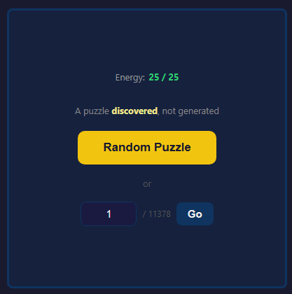
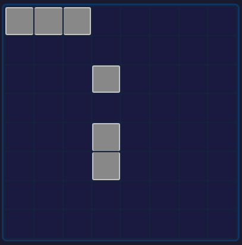
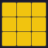
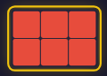
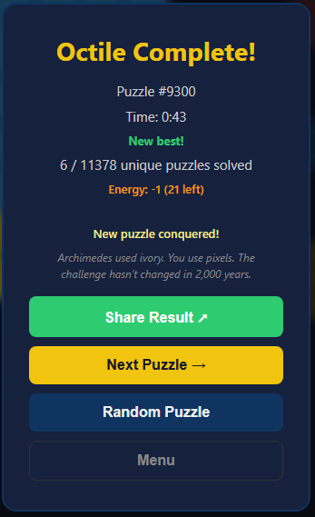

# Octile

**Archimedes had ivory. You have pixels. The challenge remains the same.**

[中文版](README_zh.md)

## About

<p align="center">
  
  
</p>

In 250 BC, Archimedes devised the *Stomachion* — a square divided into fourteen pieces of ivory. He asked a deceptively simple question: *How many distinct ways can these pieces fill the square?* The puzzle occupied mathematicians for over two millennia. Only in 2003 did Bill Cutler, with the aid of computers, find the answer: **536 unique solutions.**

Octile reimagines this ancient challenge on an 8×8 grid.

Eleven tiles — ranging from a single square to a 3×4 block — must fill all 64 cells. Three are placed by fate. The remaining eight are yours to arrange.

Like Archimedes, we asked: *How many unique puzzles exist?*

After exhaustive search under D4 symmetry — rotations and reflections — the answer is **11,378**.

Every one solvable. Every one unique.

## How to Play

- Fill an 8×8 board with 11 tiles
- 3 tiles are pre-placed; arrange the remaining 8
- No overlaps, no gaps

For the full guide — controls, energy, achievements, strategy tips, and FAQ — see [`docs/how-to-play.md`](docs/how-to-play.md) | [繁體中文](docs/how-to-play_zh.md).

### The 8 Player Tiles

<p align="center">
   &nbsp;
   &nbsp;
   &nbsp;
   &nbsp;
   &nbsp;
   &nbsp;
   &nbsp;
  
</p>

### Controls


- **Drag & drop** a tile from the piece tray onto the board, or **tap** to select then tap a cell to place
- **Tap** a selected piece again to rotate it 90°
- **Drag** a placed tile off the board (or tap it) to return it to the tray
- **#** + **Go** — jump to a specific puzzle (1–91,024)
- **Random** — load a random puzzle
- **Hint** — reveal the correct position of one unplaced tile (3 per puzzle)

## Features

- **Welcome panel** with rotating taglines from brand copy
- **Lazy timer** — starts only when you place the first piece
- **Hint system** — up to 3 hints per puzzle, each flashes the correct position
- **Energy system** — 25 energy points; each puzzle costs 1–5 based on solve time; regenerates progressively over 4 hours
- **Achievement system** — 20 badges across 5 categories (milestones, speed, dedication, streak, special) with toast notifications and trophy modal
- **Progress tracking** — tracks completed puzzles and displays unique progress (N / 91,024) with milestone messages
- **Confetti win screen** with stats, personal bests, earned badges, and "Did You Know?" facts<br>
  
- **Deep-link** — `?p=N` URL parameter jumps directly to puzzle N, skipping splash/welcome
- **Motivational quotes** — appears after 2 minutes if you're stuck
- **Tutorial hints** — contextual tips for first-time players
- **Share** — share a puzzle link (`?p=N`) or capture a screenshot of the completed board via Web Share API
- **i18n** — English / Traditional Chinese toggle; auto-detects browser locale
- **PWA-ready** — installable, works offline with service worker

### Install the App

Octile is a Progressive Web App — install it for a native-like experience with offline support.

| Platform | Steps |
|----------|-------|
| **iOS (Safari)** | Tap **Share** (□↑) → **Add to Home Screen** → **Add** |
| **Android (Chrome)** | Tap **⋮** menu → **Add to Home Screen** (or accept the install banner) |
| **macOS (Chrome)** | Click the **install icon** (⊕) in the address bar → **Install** |
| **macOS (Safari 17+)** | Click **Share** → **Add to Dock** |
| **Windows (Chrome/Edge)** | Click the **install icon** (⊕) in the address bar → **Install** |
| **Linux (Chrome)** | Click the **install icon** (⊕) in the address bar → **Install** |

Once installed, Octile runs in its own window and works fully offline.

## Key Facts

- **91,024** playable puzzles (11,378 base × 8 D4 symmetry transforms)
- Every puzzle is solvable
- No randomness, no duplicates
- Puzzles are *discovered* through exhaustive search, not randomly generated
- Inspired by Archimedes' *Stomachion* (250 BC), one of the oldest known combinatorial problems
- D4 symmetry: 4 rotations × 2 reflections = 8 orientations per base puzzle

## Mathematical Proof

The claim of exactly 11,378 puzzles is proven by exhaustive computer-assisted verification (see `verify_puzzles.py`). A formal Burnside + Exact Cover proof is available in [`docs/proof.md`](docs/proof.md).

### Problem Definition

- **Board**: 8×8 grid (64 cells)
- **Grey pieces** (define the puzzle): 1×1, 1×2, 1×3 — occupying 6 cells
- **Player pieces**: 3×4, 2×5, 3×3, 2×4, 2×3, 1×5, 1×4, 2×2 — occupying 58 cells
- A **puzzle** is a set of 6 grey cells (from valid piece placements) where the remaining 58 cells can be exactly tiled by all 8 player pieces
- Two puzzles are **equivalent** under **D4 symmetry** (4 rotations + 4 reflections of the square)

### Proof Structure

| Step | Method | Result |
|---|---|---|
| 1. Enumerate all grey placements | 64 × 112 × 96 = 688,128 raw combos, filter overlaps | ~596K valid |
| 2. Canonicalize under D4 | Lexicographic minimum of 8 transforms | **66,822** unique |
| 3. Solve each via backtracking | Exact cover: fill lowest empty cell, try all unused pieces | **11,378** solvable |
| 4. Cross-check embedded data | Decode PUZZLE_DATA, verify shapes, D4-uniqueness, solvability | All 11,378 match |

### Why Exhaustive Search Is Rigorous

Like the **Four Color Theorem** (1976) and **Kepler Conjecture** (2005), this is a computer-assisted proof. Its rigor rests on three pillars:

1. **Completeness** — the search space is finite and fully enumerated (all valid grey piece placements on 8×8)
2. **Correct deduplication** — D4 canonical forms via group-theoretic symmetry (Burnside's lemma)
3. **Solver correctness** — backtracking exact cover always targets the lowest empty cell; soundness + completeness are guaranteed

### Running the Verification

```bash
python3 verify_puzzles.py
```

Typical output (~26s on 8 cores):

```
Phase 1: Verify embedded PUZZLE_DATA
  All puzzles valid: correct cell ranges, shapes, and D4-unique
  All 11,378 embedded puzzles are solvable

Phase 2: Exhaustive enumeration (proves completeness)
  Found 66,822 canonical placements
  Solvable puzzles found: 11,378

  VERIFIED: exactly 11,378 unique solvable puzzles exist.
```

---

If you enjoy Octile, [buy me a coffee](https://wise.com/pay/me/shunshengo).
