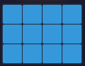
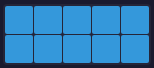
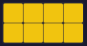
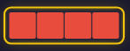
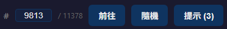
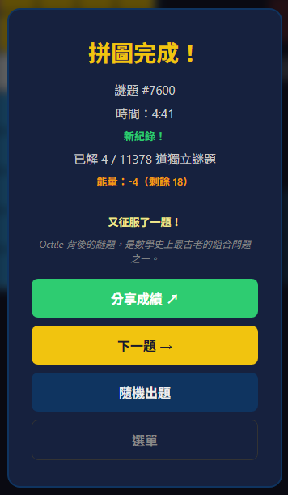

# Octile

**阿基米德用的是象牙。你用的是像素。但挑戰，從未改變。**

[English](README.md)

## 關於

<p align="center">
  
  
</p>

西元前 250 年，阿基米德設計了 *Stomachion* —— 一個被切成 14 塊象牙拼片的正方形。他提出了一個看似簡單的問題：*這些拼片，一共有多少種不同的方式可以重新拼回正方形？*

這個問題，困擾了數學家超過兩千年。直到 2003 年，在電腦的輔助下，數學家 Bill Cutler 才找出答案：**536 種不同解法。**

Octile 將這個古老的挑戰，重新帶到一個 **8×8 的棋盤**上。

11 塊拼片，從 1×1 到 3×4，必須完整填滿 64 個格子。其中 3 塊由命運決定，剩下的 8 塊，由你安排。

就像阿基米德一樣，我們也問了一個問題：*究竟有多少種不同的 Octile 謎題？*

在考慮旋轉與鏡射（D4 對稱）的情況下，經過完整搜尋，答案是 **11,378**。

每一題都有解。每一題都獨一無二。

## 遊戲方法

- 用 11 塊拼片填滿 8×8 棋盤
- 3 塊拼片已預先放置，安排剩餘的 8 塊
- 不能重疊，不能留空

完整指南（操作、體力、成就、攻略技巧與常見問題）請見 [`docs/how-to-play_zh.md`](docs/how-to-play_zh.md) | [English](docs/how-to-play.md)。

### 8 塊玩家拼片

<p align="center">
   &nbsp;
   &nbsp;
   &nbsp;
   &nbsp;
   &nbsp;
   &nbsp;
   &nbsp;
  
</p>

### 控制



- 從拼片區**拖曳**拼片到棋盤上，或**點擊**選取後點擊空格放置
- 再次**點擊**已選取的拼片可旋轉 90°
- 將已放置的拼片從棋盤上**拖曳**出來（或點擊）即可收回
- **#** + **前往** —— 跳到指定謎題（1–11,378）
- **隨機** —— 載入隨機謎題
- **提示** —— 顯示一塊未放置拼片的正確位置（每題 3 次）

## 功能特色

- **歡迎面板**，每次顯示不同的品牌標語
- **懶載計時器** —— 放置第一塊拼片時才開始計時
- **提示系統** —— 每題最多 3 次提示，閃爍顯示正確位置
- **體力系統** —— 25 點體力；每題消耗 1–5 點（依解題時間）；4 小時內逐步恢復
- **成就系統** —— 20 枚徽章，涵蓋 5 大類別（里程碑、速度、毅力、連勝、特殊），附吐司通知與獎盃視窗
- **進度追蹤** —— 記錄已完成謎題，顯示獨立進度（N / 11,378）與里程碑訊息
- **勝利畫面**，含統計數據、個人最佳紀錄、獲得徽章與「你知道嗎？」小知識<br>
  
- **深層連結** —— `?p=N` 網址參數可直接跳到指定謎題，跳過啟動畫面
- **鼓勵語句** —— 卡關 2 分鐘後出現激勵文字
- **教學提示** —— 為新手玩家提供情境式引導
- **分享** —— 分享謎題連結（`?p=N`）或透過 Web Share API 擷取完成棋盤截圖分享
- **多語言** —— 英文／繁體中文切換，自動偵測瀏覽器語系
- **PWA** —— 可安裝，支援離線使用

## 關鍵數據

- **11,378** 道數學驗證謎題
- 每一題都有解
- 沒有隨機，沒有重複
- 謎題是透過完整搜尋「*發現*」的，而非隨機生成
- 靈感來自阿基米德的 *Stomachion*（西元前 250 年），數學史上最古老的組合問題之一
- 在 D4 對稱下驗證 —— 旋轉與鏡射視為同一題

## 數學證明

「恰好 11,378 道謎題」的宣稱，由窮舉電腦輔助驗證所證明（見 `verify_puzzles.py`）。正式的 Burnside + Exact Cover 證明請見 [`docs/proof.md`](docs/proof.md)。

### 問題定義

- **棋盤**：8×8 網格（64 格）
- **灰色拼片**（定義謎題）：1×1、1×2、1×3 —— 佔 6 格
- **玩家拼片**：3×4、2×5、3×3、2×4、2×3、1×5、1×4、2×2 —— 佔 58 格
- 一道**謎題**是一組 6 個灰色格子（來自有效拼片放置），使剩餘 58 格能被 8 塊玩家拼片恰好填滿
- 兩道謎題在 **D4 對稱**（4 次旋轉 + 4 次鏡射）下視為**等價**

### 證明結構

| 步驟 | 方法 | 結果 |
|---|---|---|
| 1. 列舉所有灰色放置 | 64 × 112 × 96 = 688,128 種原始組合，過濾重疊 | ~596K 有效 |
| 2. D4 正規化 | 取 8 種變換的字典序最小值 | **66,822** 種唯一放置 |
| 3. 逐一回溯求解 | 精確覆蓋：填最低空格，嘗試所有未用拼片 | **11,378** 可解 |
| 4. 交叉驗證內嵌資料 | 解碼 PUZZLE_DATA，驗證形狀、D4 唯一性、可解性 | 全部 11,378 吻合 |

### 為何窮舉搜尋是嚴謹的

如同**四色定理**（1976）和**克卜勒猜想**（2005），這是電腦輔助證明。其嚴謹性建立在三根支柱上：

1. **完備性** —— 搜索空間有限且完整列舉（8×8 上所有有效灰色拼片放置）
2. **正確去重** —— 透過群論對稱性的 D4 正規化形式（Burnside 引理）
3. **求解器正確性** —— 回溯精確覆蓋始終鎖定最低空格；健全性與完備性皆有保證

### 執行驗證

```bash
python3 verify_puzzles.py
```

典型輸出（8 核心約 26 秒）：

```
Phase 1: Verify embedded PUZZLE_DATA
  All puzzles valid: correct cell ranges, shapes, and D4-unique
  All 11,378 embedded puzzles are solvable

Phase 2: Exhaustive enumeration (proves completeness)
  Found 66,822 canonical placements
  Solvable puzzles found: 11,378

  VERIFIED: exactly 11,378 unique solvable puzzles exist.
```

---

如果你喜歡 Octile，[請我喝杯咖啡](https://wise.com/pay/me/shunshengo)。
