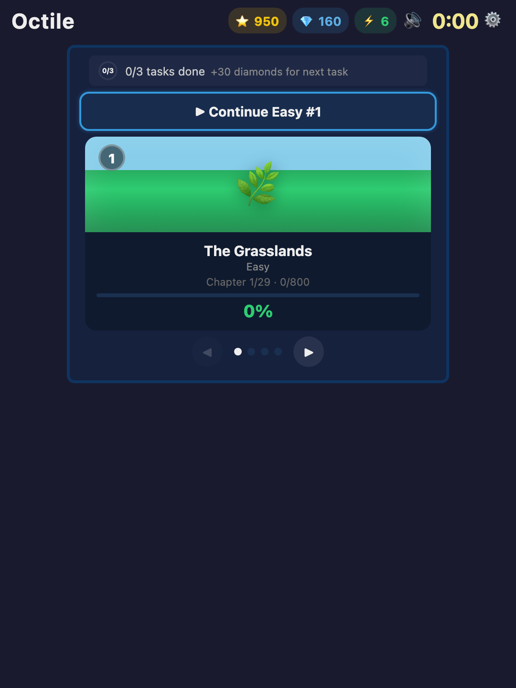
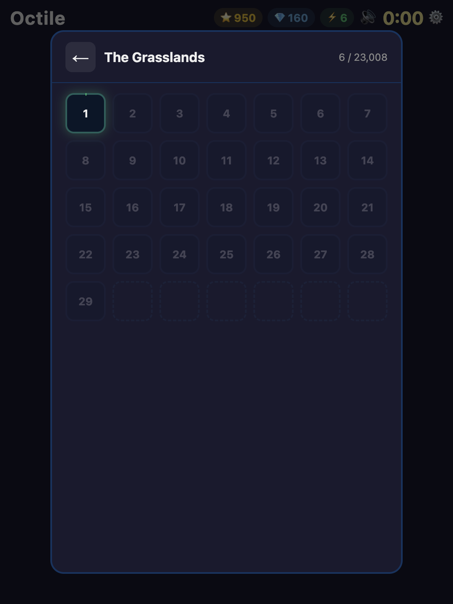
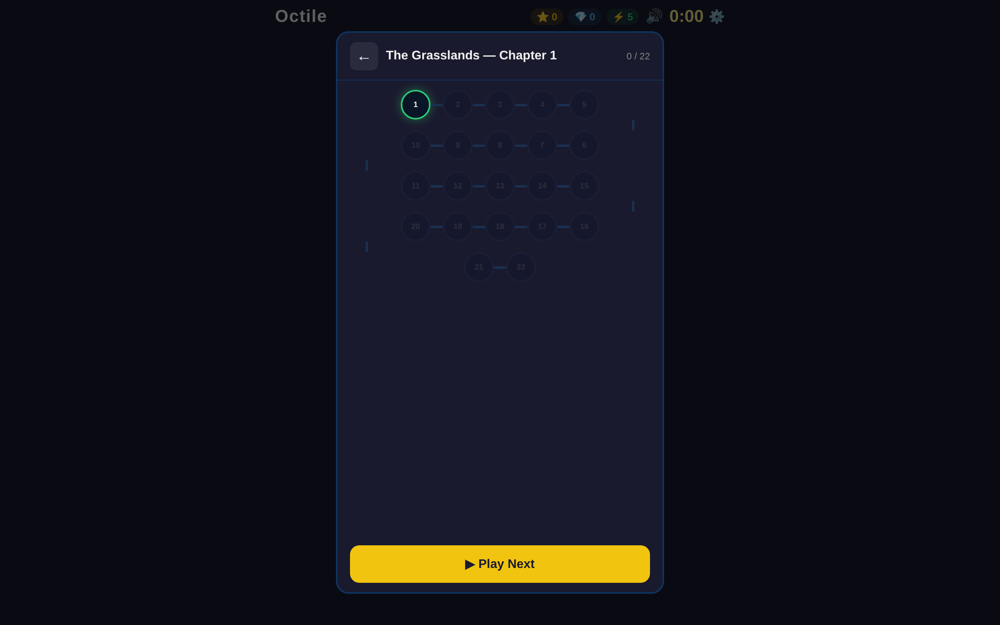
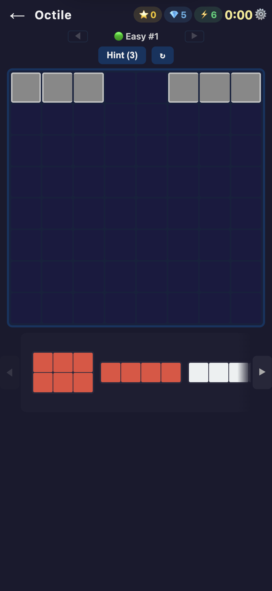
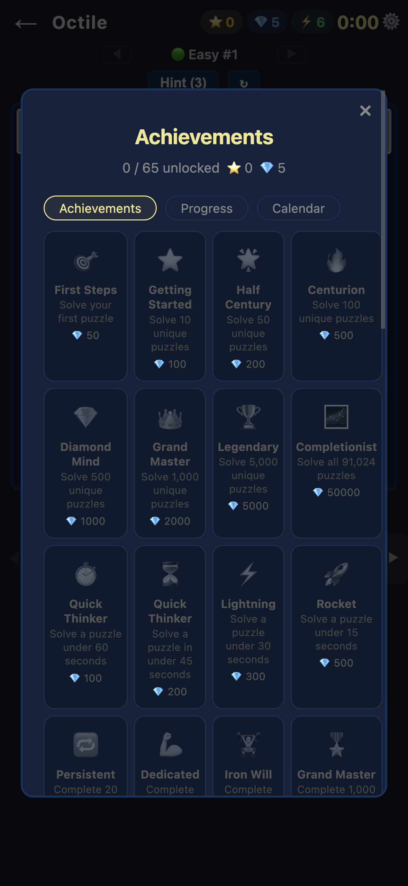
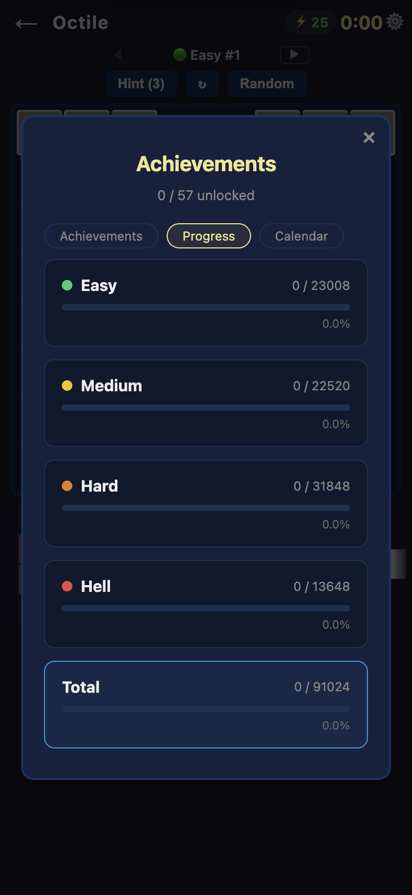
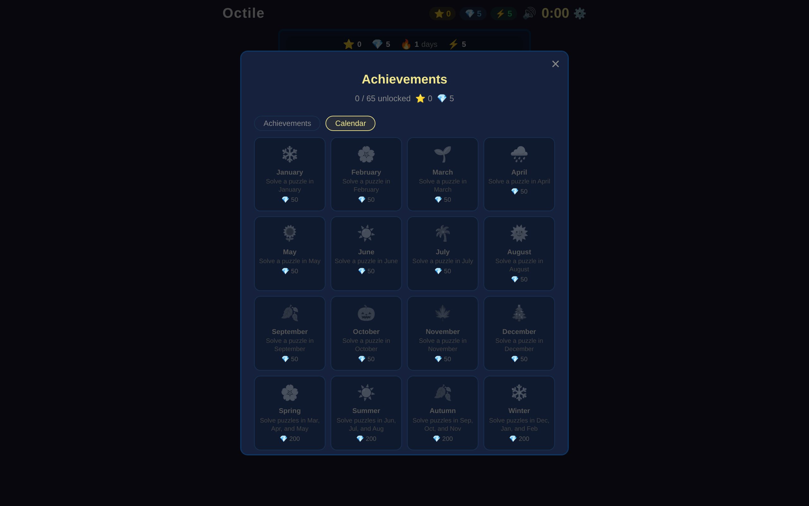
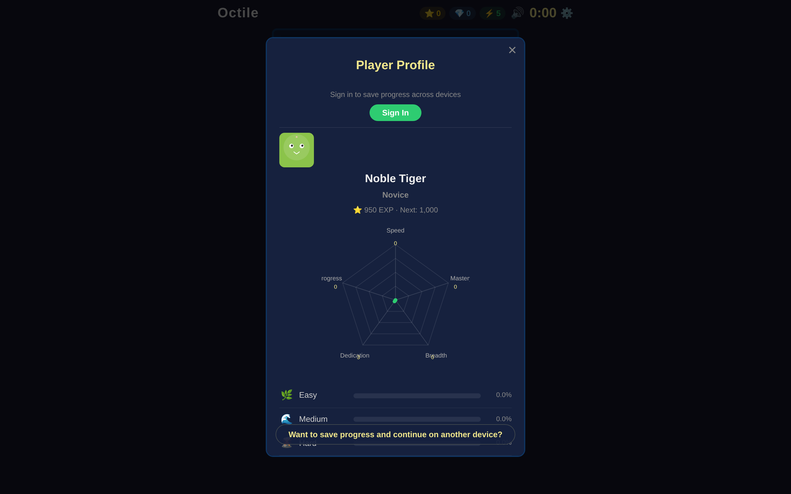

# How to Play Octile

## Quick Start



1. Open the game — the **welcome panel** appears with four difficulty levels
2. Choose a level (**Easy**, **Medium**, **Hard**, **Hell**) to start your next puzzle
3. **Drag** tiles from the piece tray onto the 8×8 board (or tap to select, then tap a cell)
4. Fill every empty cell — no overlaps, no gaps
5. Board complete? You win!

---

## Difficulty Levels

Octile organizes its 91,024 puzzles into four difficulty levels based on solver complexity:

| Level      | Puzzles | Description                          |
| ---------- | ------- | ------------------------------------ |
| Easy       | 23,008  | Straightforward placements           |
| Medium     | 22,520  | Requires more thought                |
| Hard       | 31,848  | Significant backtracking needed      |
| Hell       | 13,648  | Extremely challenging configurations |

- Tap a level card on the welcome panel to start
- Each level is divided into **chapters** — tap a level to see the chapter grid
- Puzzles are played **sequentially** within each chapter via the puzzle path
- Your progress is saved per level — pick up where you left off
- Complete all puzzles in a level to earn **level achievements**





---

## The Board



- **8x8 grid** — 64 cells total
- **3 grey tiles** are pre-placed and cannot be moved — they define the puzzle
- **8 colored tiles** sit in the piece tray — these are yours to arrange

### The 11 Tiles

**Grey (pre-placed, 6 cells total):** 1x1, 1x2, 1x3

**Player tiles (58 cells total):**

The piece tray is shown below the board:

| Tile | Size     | Color  | Preview |
| ---- | -------- | ------ | ------- |
| 3x4  | 12 cells | Blue   |  |
| 2x5  | 10 cells | Blue   |  |
| 3x3  | 9 cells  | Yellow |  |
| 2x4  | 8 cells  | Yellow |  |
| 2x3  | 6 cells  | Red    |  |
| 1x5  | 5 cells  | White  |  |
| 1x4  | 4 cells  | Red    |  |
| 2x2  | 4 cells  | White  |  |

Grey + Player = **64 cells** (the entire board).

---

## Controls

### Place a Tile

- **Drag & drop** — drag a tile from the piece tray and drop it onto the board
- **Tap to place** — tap a tile to select it (yellow highlight), then tap an empty cell on the board

### Scroll Tiles

- Use the **◀ / ▶** arrow buttons beside the piece tray to scroll through pieces
- You can also **swipe horizontally** on the piece tray

### Rotate a Tile

- **Tap** an already-selected tile again to rotate it 90 degrees
- Repeat to cycle through orientations

### Remove a Tile

- **Drag** a placed tile off the board to return it to the tray
- Or **tap** a placed tile on the board to pick it back up

### Navigation

| Control    | Action                                           |
| ---------- | ------------------------------------------------ |
| **◀ / ▶** | Navigate between puzzles within a level          |
| **Hint**   | Reveal the correct position of one unplaced tile |
| **↻**      | Restart the current puzzle (reset board + timer) |

During level play, use the **◀** and **▶** arrows to move between puzzles. You can freely skip ahead or go back to replay earlier puzzles.

---

## Energy System

Each puzzle costs energy. Solve faster to spend less.

| Solve Time   | Energy Cost |
| ------------ | ----------- |
| <= 60 seconds | 1           |
| <= 2 minutes  | 2           |
| <= 3 minutes  | 3           |
| <= 5 minutes  | 4           |
| > 5 minutes  | 5           |

- You start with **25 energy points**
- Energy **regenerates progressively** over **4 hours** back to 25
- Energy is deducted **after** you solve a puzzle, not when you start one
- You need at least **1 energy** to start a new puzzle
- Tap the energy display in the header to see your full energy status and recovery timer
- You can **restore 1 play** by spending **50 diamonds** from the energy modal

---

## Hints

- Tap the **Hint** button to reveal one unplaced tile's correct position
- The correct cells flash briefly on the board
- **3 hints per day** — resets when you start a new puzzle after midnight
- Hints do not affect your solve time or energy cost
- Solving without hints earns the **Pure Logic** achievement

---

## Timer

- The timer is **lazy** — it only starts when you place your first tile
- Browsing the welcome panel or rotating tiles in the tray does not start the clock
- Your best time per puzzle is saved automatically

---

## Win Screen

When you fill the board correctly:

- **Confetti** celebration
- **Solve time** and personal best comparison
- **Unique progress** — how many of the 91,024 puzzles you've completed
- **Energy cost** for this solve
- **Newly earned badges** (if any)
- **"Did You Know?"** — a rotating fun fact about Octile or its history
- **Level Complete** banner when you finish the last puzzle in a level

### After winning, you can:

- **Share Result** — sends a screenshot of your completed board + puzzle link via Web Share API (or copies to clipboard)
- **View Board** — review your completed board
- **Next Puzzle** — load the next puzzle in the level
- **Menu** — return to the welcome panel

---

## Leaderboard

Tap the scoreboard button in the settings to view the global leaderboard. Players are ranked by total puzzles solved. Your rank and stats are visible to others.

---

## Sharing

- **During gameplay** — tap the share button to share a link to the current puzzle
- **On the win screen** — tap **Share Result** to share a board screenshot with your time
- Shared links use the `?p=N` format, so recipients jump directly to that puzzle

---

## Achievements

Octile has **57 badges** across 3 tabs. Open the menu and tap **Achievements** to view your collection.







### Milestones (unique puzzles solved)

| Badge | Name            | Requirement                |
| ----- | --------------- | -------------------------- |
| 🎯    | First Steps     | Solve 1 puzzle             |
| ⭐    | Getting Started | Solve 10 unique puzzles    |
| 🌟    | Half Century    | Solve 50 unique puzzles    |
| 🔥    | Centurion       | Solve 100 unique puzzles   |
| 💎    | Diamond Mind    | Solve 500 unique puzzles   |
| 👑    | Grand Master    | Solve 1,000 unique puzzles |
| 🏆    | Legendary       | Solve 5,000 unique puzzles |
| 🌌    | Completionist   | Solve all 91,024 puzzles   |

### Speed

| Badge | Name          | Requirement            |
| ----- | ------------- | ---------------------- |
| ⏱️    | Quick Thinker | Solve under 60 seconds |
| ⏳    | Swift Mind    | Solve under 45 seconds |
| ⚡    | Lightning     | Solve under 30 seconds |
| 🚀    | Rocket        | Solve under 15 seconds |

### Dedication (total solves, including re-solves)

| Badge | Name       | Requirement        |
| ----- | ---------- | ------------------ |
| 🔁    | Persistent | 20 total solves    |
| 💪    | Dedicated  | 100 total solves   |
| 🏋️    | Iron Will  | 500 total solves   |
| 🎖️    | Unstoppable | 1,000 total solves |

### Streak (consecutive days)

| Badge | Name             | Requirement        |
| ----- | ---------------- | ------------------ |
| 🔥    | Three-peat       | 3 days in a row    |
| 🌈    | Full Week        | 7 days in a row    |
| ☄️    | Monthly Devotion | 30 days in a row   |
| 🌋    | Hundred Days     | 100 days in a row  |
| 🌊    | Two Hundred      | 200 days in a row  |
| 🌍    | Three Hundred    | 300 days in a row  |
| 🎉    | Full Year        | 365 days in a row  |

### Special

| Badge | Name           | Requirement                                |
| ----- | -------------- | ------------------------------------------ |
| 🤔    | Pure Logic     | Solve a new puzzle without hints           |
| 🎆    | Daily Grind    | Solve 5 puzzles in one day                 |
| 💯    | Ten a Day      | Solve 10 puzzles in one day                |
| 🦉    | Night Owl      | Solve a puzzle between 10 PM and 5 AM      |
| 🌙    | Night Century  | 100 solves between 10 PM and 5 AM          |
| 🌅    | Morning Century | 100 solves between 4:30 AM and 9 AM       |
| 🏖️    | Weekend Warrior | Solve a puzzle on a weekend                |
| 🥇    | Number One     | Reach rank 1 on the leaderboard            |

### Level Achievements

| Badge | Name             | Requirement                    |
| ----- | ---------------- | ------------------------------ |
| 🌿    | Easy 100         | Complete 100 Easy puzzles      |
| 🌾    | Easy 1000        | Complete 1,000 Easy puzzles    |
| 🔶    | Medium 100       | Complete 100 Medium puzzles    |
| 🔷    | Medium 1000      | Complete 1,000 Medium puzzles  |
| 🔸    | Hard 100         | Complete 100 Hard puzzles      |
| 🔹    | Hard 1000        | Complete 1,000 Hard puzzles    |
| 🔺    | Hell 100         | Complete 100 Hell puzzles      |
| 🔻    | Hell 1000        | Complete 1,000 Hell puzzles    |

### Calendar Achievements

Play in different months and seasons to collect these:

- **12 Monthly badges** — one for each month of the year
- **4 Seasonal badges** — Spring (Mar-May), Summer (Jun-Aug), Autumn (Sep-Nov), Winter (Dec-Feb)
- **Half Year** — play in 6 different months
- **Four Seasons** — play in all 12 months

---

## Player Profile

Open the menu and tap **Profile** to view your player card with radar chart, grade distribution, ELO rating, and rank.



---

## Offline Mode

Octile works fully offline as a PWA (Progressive Web App).

- **88 random puzzles** are bundled for free play
- **22 puzzles per level** are bundled for level-based play
- Scores are **queued** offline and synced automatically when you reconnect
- Level progress is saved locally

When you exhaust the offline puzzles for a level, a message prompts you to connect for more.

---

## Deep Links

You can link directly to any puzzle using URL parameters:

```
https://mtaleon.github.io/octile/?p=42
```

This skips the splash screen and welcome panel, loading puzzle #42 immediately.

---

## Tips & Strategy

- **Start with the largest tile** (3x4, 12 cells) — it has the fewest possible positions
- **Corner and edge placements** are more constrained — use them to your advantage
- **Work from constraints** — fill the tightest spaces first
- **Use hints wisely** — you only get 3 per day
- **Every puzzle is solvable** — if you're stuck, rethink your approach rather than restarting
- **Solve quickly** to conserve energy — under 60 seconds costs only 1 point

---

## FAQ

**Q: Are puzzles randomly generated?**
No. All 91,024 puzzles are derived from 11,378 base configurations discovered through exhaustive mathematical search. With D4 symmetry (rotations and reflections), each base puzzle yields 8 variants. Every puzzle is solvable and unique.

**Q: Can a puzzle be unsolvable?**
No. Every puzzle has been verified to have at least one valid solution.

**Q: What does D4 symmetry mean?**
D4 is the symmetry group of the square: 4 rotations x 2 reflections = 8 transforms. Each of the 11,378 base puzzles generates 8 playable variants (91,024 total).

**Q: Does the game work offline?**
Yes. Octile is a PWA. Once loaded, it works offline with 88 random puzzles and 22 puzzles per level. Scores sync when you reconnect.

**Q: How do I change the language?**
Open the menu (gear icon) and tap the **Language** toggle. The game auto-detects your browser locale on first visit.

**Q: What happens when I run out of energy?**
You cannot start a new puzzle until at least 1 point recovers. Energy regenerates continuously — full recovery takes 4 hours from zero.

**Q: How are difficulty levels determined?**
Each puzzle is classified by the number of backtracking steps a computer solver needs. Easy puzzles require minimal backtracking; Hell puzzles require extensive search.
