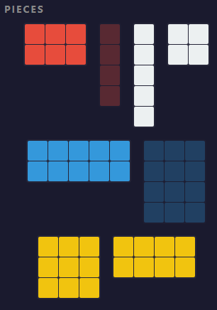
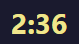
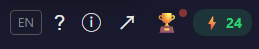
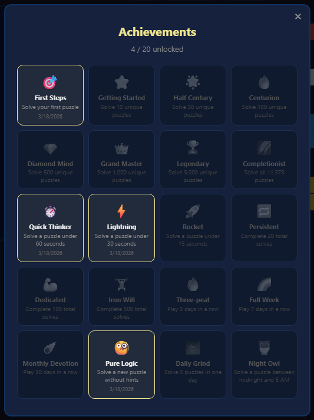

# How to Play Octile

## Quick Start


1. Open the game — the **welcome panel** appears
2. Tap **Random Puzzle** or enter a puzzle number and tap **Go**
3. **Drag** tiles from the piece tray onto the 8×8 board (or tap to select, then tap a cell)
4. Fill every empty cell — no overlaps, no gaps
5. Board complete? You win!

---

## The Board


- **8×8 grid** — 64 cells total
- **3 grey tiles** are pre-placed and cannot be moved — they define the puzzle
- **8 colored tiles** sit in the piece tray — these are yours to arrange

### The 11 Tiles

**Grey (pre-placed, 6 cells total):** 1×1, 1×2, 1×3

**Player tiles (58 cells total):**



| Tile | Size     | Color  | Preview |
| ---- | -------- | ------ | ------- |
| 3×4  | 12 cells | Blue   |  |
| 2×5  | 10 cells | Blue   |  |
| 3×3  | 9 cells  | Yellow |  |
| 2×4  | 8 cells  | Yellow |  |
| 2×3  | 6 cells  | Red    |  |
| 1×5  | 5 cells  | White  |  |
| 1×4  | 4 cells  | Red    |  |
| 2×2  | 4 cells  | White  |  |

Grey + Player = **64 cells** (the entire board).

---

## Controls

### Place a Tile

- **Drag & drop** — drag a tile from the piece tray and drop it onto the board
- **Tap to place** — tap a tile to select it (yellow highlight), then tap an empty cell on the board

### Rotate a Tile

- **Tap** an already-selected tile again to rotate it 90°
- Repeat to cycle through orientations

### Remove a Tile

- **Drag** a placed tile off the board to return it to the tray
- Or **tap** a placed tile on the board to pick it back up

### Navigation


| Control        | Action                                           |
| -------------- | ------------------------------------------------ |
| **#** + **Go** | Jump to a specific puzzle (1–11,378)             |
| **Random**     | Load a random puzzle                             |
| **Hint**       | Reveal the correct position of one unplaced tile |

---

## Energy System

Each puzzle costs energy. Solve faster to spend less.

| Solve Time   | Energy Cost |
| ------------ | ----------- |
| ≤ 60 seconds | 1           |
| ≤ 2 minutes  | 2           |
| ≤ 3 minutes  | 3           |
| ≤ 5 minutes  | 4           |
| > 5 minutes  | 5           |

- You start with **25 energy points**
- Energy **regenerates progressively** over **4 hours** back to 25
- Energy is deducted **after** you solve a puzzle, not when you start one
- You need at least **1 energy** to start a new puzzle
- Tap the **⚡ energy display** in the header to see your full energy status and recovery timer

---

## Hints

- Tap the **Hint** button to reveal one unplaced tile's correct position
- The correct cells flash briefly on the board
- **3 hints per puzzle** maximum
- Hints do not affect your solve time or energy cost
- Solving without hints earns the **Pure Logic** achievement

---

## Timer



- The timer is **lazy** — it only starts when you place your first tile
- Browsing the welcome panel or rotating tiles in the tray does not start the clock
- Your best time per puzzle is saved automatically

---

## Win Screen


When you fill the board correctly:

- **Confetti** celebration
- **Solve time** and personal best comparison
- **Unique progress** — how many of the 11,378 puzzles you've completed
- **Energy cost** for this solve
- **Newly earned badges** (if any)
- **"Did You Know?"** — a rotating fun fact about Octile or its history
- **Motivational messages** for milestones, speed achievements, and personal bests

### After winning, you can:

- **Share Result** — sends a screenshot of your completed board + puzzle link via Web Share API (or copies to clipboard)
- **Next Puzzle** — load the next puzzle in sequence
- **Random Puzzle** — load a random puzzle
- **Menu** — return to the welcome panel

---

## Sharing

- **During gameplay** — tap the share button (↗) to share a link to the current puzzle
- **On the win screen** — tap **Share Result** to share a board screenshot with your time
- Shared links use the `?p=N` format, so recipients jump directly to that puzzle

---

## Achievements

Octile has **20 badges** across 5 categories. Tap the trophy button in the header to view your collection.





### Milestones (unique puzzles solved)

| Badge | Name            | Requirement                |
| ----- | --------------- | -------------------------- |
| 🎯    | First Steps     | Solve 1 puzzle             |
| ⭐    | Getting Started | Solve 10 unique puzzles    |
| 🌟    | Half Century    | Solve 50 unique puzzles    |
| 🔥    | Centurion       | Solve 100 unique puzzles   |
| 💎    | Diamond Mind    | Solve 500 unique puzzles   |
| 👑    | Grand Master    | Solve 1,000 unique puzzles |
| 🏆    | Legendary       | Solve 5,000 unique puzzles |
| 🌌    | Completionist   | Solve all 11,378 puzzles   |

### Speed

| Badge | Name          | Requirement            |
| ----- | ------------- | ---------------------- |
| ⏱️    | Quick Thinker | Solve under 60 seconds |
| ⚡    | Lightning     | Solve under 30 seconds |
| 🚀    | Rocket        | Solve under 15 seconds |

### Dedication (total solves, including re-solves)

| Badge | Name       | Requirement      |
| ----- | ---------- | ---------------- |
| 🔁    | Persistent | 20 total solves  |
| 💪    | Dedicated  | 100 total solves |
| 🏋️    | Iron Will  | 500 total solves |

### Streak (consecutive days)

| Badge | Name             | Requirement      |
| ----- | ---------------- | ---------------- |
| 🔥    | Three-peat       | 3 days in a row  |
| 🌈    | Full Week        | 7 days in a row  |
| ☄️    | Monthly Devotion | 30 days in a row |

### Special

| Badge | Name        | Requirement                              |
| ----- | ----------- | ---------------------------------------- |
| 🤔    | Pure Logic  | Solve a new puzzle without hints         |
| 🎆    | Daily Grind | Solve 5 puzzles in one day               |
| 🦉    | Night Owl   | Solve a puzzle between midnight and 5 AM |

---

## Deep Links

You can link directly to any puzzle using URL parameters:

```
https://mtaleon.github.io/octile/?p=42
```

This skips the splash screen and welcome panel, loading puzzle #42 immediately.

---

## Tips & Strategy

- **Start with the largest tile** (3×4, 12 cells) — it has the fewest possible positions
- **Corner and edge placements** are more constrained — use them to your advantage
- **Work from constraints** — fill the tightest spaces first
- **Use hints wisely** — you only get 3 per puzzle
- **Every puzzle is solvable** — if you're stuck, rethink your approach rather than restarting
- **Solve quickly** to conserve energy — under 60 seconds costs only 1 point

---

## FAQ

**Q: Are puzzles randomly generated?**
No. All 11,378 puzzles are discovered through exhaustive mathematical search and verified under D4 symmetry (rotations and reflections). Every puzzle is unique.

**Q: Can a puzzle be unsolvable?**
No. Every puzzle has been verified to have at least one valid solution.

**Q: What does D4 symmetry mean?**
If you rotate or flip a puzzle, it's considered the same puzzle. This ensures no duplicates exist in the 11,378 set.

**Q: Does the game work offline?**
Yes. Octile is a PWA (Progressive Web App). Once loaded, it works offline. You can also install it to your home screen.

**Q: How do I change the language?**
Tap the **文 / EN** button in the top-left corner. The game auto-detects your browser locale on first visit.

**Q: What happens when I run out of energy?**
You cannot start a new puzzle until at least 1 point recovers. Energy regenerates continuously — full recovery takes 4 hours from zero.
