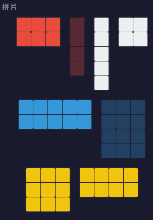
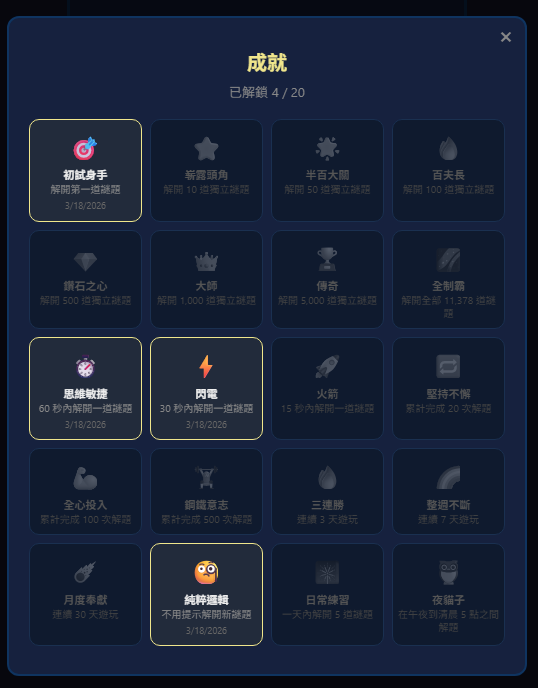

# Octile 遊戲指南

## 快速開始


1. 開啟遊戲 —— **歡迎面板**出現
2. 選擇難度關卡（**簡單**、**中等**、**困難**、**地獄**）或點擊**隨機出題**
3. 從拼片區**拖曳**拼片到 8x8 棋盤上（或點擊選取後點擊空格放置）
4. 填滿每個空格 —— 不重疊、不留空
5. 棋盤填滿？你贏了！

---

## 難度關卡

Octile 將 91,024 道謎題依求解複雜度分為四個難度關卡：

| 關卡 | 謎題數 | 說明               |
| ---- | ------ | ------------------ |
| 簡單 | 23,008 | 直覺式放置         |
| 中等 | 22,520 | 需要更多思考       |
| 困難 | 31,848 | 需大量回溯嘗試     |
| 地獄 | 13,648 | 極具挑戰性的配置   |

- 在歡迎面板點擊關卡卡片開始
- 每個關卡的謎題按**順序**進行
- 進度按關卡獨立儲存 —— 隨時可繼續
- 完成關卡所有謎題可獲得**關卡成就**

也可點擊**隨機出題**，不分難度隨機遊玩。

---

## 棋盤


- **8x8 網格** —— 共 64 格
- **3 塊灰色拼片**已預先放置，無法移動 —— 它們定義了這道謎題
- **8 塊彩色拼片**放在拼片區 —— 由你來安排

### 11 塊拼片一覽

**灰色（預置，共 6 格）：** 1x1、1x2、1x3

**玩家拼片（共 58 格）：**



| 拼片 | 尺寸  | 顏色 | 預覽 |
| ---- | ----- | ---- | ---- |
| 3x4  | 12 格 | 藍色 |  |
| 2x5  | 10 格 | 藍色 |  |
| 3x3  | 9 格  | 黃色 |  |
| 2x4  | 8 格  | 黃色 |  |
| 2x3  | 6 格  | 紅色 |  |
| 1x5  | 5 格  | 白色 |  |
| 1x4  | 4 格  | 紅色 |  |
| 2x2  | 4 格  | 白色 |  |

灰色 + 玩家 = **64 格**（整個棋盤）。

---

## 操作方式

### 放置拼片

- **拖曳放置** —— 從拼片區拖曳拼片到棋盤上
- **點擊放置** —— 點擊拼片選取（黃色高亮），再點擊棋盤上的空格放置

### 旋轉拼片

- 再次**點擊**已選取的拼片即可旋轉 90°
- 重複點擊可循環各方向

### 移除拼片

- 將已放置的拼片從棋盤上**拖曳**出來即可收回
- 或**點擊**棋盤上的拼片即可拿起

### 導覽


| 控制         | 動作                         |
| ------------ | ---------------------------- |
| **◀ / ▶**   | 在關卡內切換謎題             |
| **隨機**     | 載入隨機謎題                 |
| **提示**     | 顯示一塊未放置拼片的正確位置 |

在關卡遊玩時，使用控制列上方的 **◀** 和 **▶** 箭頭切換謎題。可以自由跳過或返回重玩之前的謎題。

---

## 體力系統

每道謎題消耗體力。解題越快，消耗越少。

| 解題時間 | 體力消耗 |
| -------- | -------- |
| <= 60 秒  | 1        |
| <= 2 分鐘 | 2        |
| <= 3 分鐘 | 3        |
| <= 5 分鐘 | 4        |
| > 5 分鐘 | 5        |

- 初始擁有 **25 點體力**
- 體力在 **4 小時**內**逐步恢復**至 25 點
- 體力在**解題後**扣除，而非開始時
- 開始新謎題至少需要 **1 點體力**
- 點擊標題列的體力顯示可查看完整體力狀態與恢復計時

---

## 提示

- 點擊**提示**按鈕可顯示一塊未放置拼片的正確位置
- 正確位置會在棋盤上短暫閃爍
- 每日 **3 次提示** —— 午夜後開始新謎題時重置
- 提示不影響解題時間或體力消耗
- 不使用提示解題可獲得**純粹邏輯**成就

---

## 計時器


- 計時器是**懶載**的 —— 放置第一塊拼片時才開始計時
- 瀏覽歡迎面板或在拼片區旋轉拼片不會啟動計時
- 每題最佳時間會自動儲存

---

## 勝利畫面


當你正確填滿棋盤：

- **彩紙慶祝**動畫
- **解題時間**與個人最佳紀錄對比
- **獨立進度** —— 你已完成 91,024 題中的多少
- **體力消耗**
- **新獲得的徽章**（如有）
- **「你知道嗎？」** —— 關於 Octile 或其歷史的趣味小知識
- 完成關卡最後一題時顯示**關卡完成**橫幅

### 勝利後可以：

- **分享成績** —— 透過 Web Share API 傳送完成棋盤截圖 + 謎題連結（或複製到剪貼簿）
- **下一題** —— 載入關卡中的下一道謎題（隨機模式則為順序下一題）
- **隨機出題** —— 載入隨機謎題
- **選單** —— 返回歡迎面板

---

## 排行榜

點擊設定中的排行榜按鈕可查看全球排名。玩家依總解題數排名，你的排名與數據對其他人可見。

---

## 分享

- **遊戲中** —— 點擊分享按鈕分享當前謎題的連結
- **勝利畫面** —— 點擊**分享成績**傳送棋盤截圖與你的時間
- 分享連結使用 `?p=N` 格式，收到的人可直接跳到該謎題

---

## 成就系統

Octile 共有 **57 枚徽章**，分為 7 大類別。點擊標題列的獎盃按鈕可查看你的收藏。




### 里程碑（已解獨立謎題數）

| 徽章 | 名稱     | 條件                   |
| ---- | -------- | ---------------------- |
| 🎯   | 初試身手 | 解開 1 題              |
| ⭐   | 嶄露頭角 | 解開 10 道獨立謎題     |
| 🌟   | 半百大關 | 解開 50 道獨立謎題     |
| 🔥   | 百夫長   | 解開 100 道獨立謎題    |
| 💎   | 鑽石之心 | 解開 500 道獨立謎題    |
| 👑   | 大師     | 解開 1,000 道獨立謎題  |
| 🏆   | 傳奇     | 解開 5,000 道獨立謎題  |
| 🌌   | 全制霸   | 解開全部 91,024 道謎題 |

### 速度

| 徽章 | 名稱     | 條件        |
| ---- | -------- | ----------- |
| ⏱️   | 思維敏捷 | 60 秒內解題 |
| ⏳   | 迅捷之心 | 45 秒內解題 |
| ⚡   | 閃電     | 30 秒內解題 |
| 🚀   | 火箭     | 15 秒內解題 |

### 毅力（累計解題次數，含重複解題）

| 徽章 | 名稱     | 條件             |
| ---- | -------- | ---------------- |
| 🔁   | 堅持不懈 | 累計 20 次解題   |
| 💪   | 全心投入 | 累計 100 次解題  |
| 🏋️   | 鋼鐵意志 | 累計 500 次解題  |
| 🎖️   | 勢不可擋 | 累計 1,000 次解題 |

### 連勝（連續遊玩天數）

| 徽章 | 名稱     | 條件             |
| ---- | -------- | ---------------- |
| 🔥   | 三連勝   | 連續 3 天遊玩    |
| 🌈   | 整週不斷 | 連續 7 天遊玩    |
| ☄️   | 月度奉獻 | 連續 30 天遊玩   |
| 🌋   | 百日不輟 | 連續 100 天遊玩  |
| 🌊   | 二百日   | 連續 200 天遊玩  |
| 🌍   | 三百日   | 連續 300 天遊玩  |
| 🎉   | 全年無休 | 連續 365 天遊玩  |

### 特殊

| 徽章 | 名稱       | 條件                             |
| ---- | ---------- | -------------------------------- |
| 🤔   | 純粹邏輯   | 不用提示解開新謎題               |
| 🎆   | 日常練習   | 一天內解開 5 道謎題              |
| 💯   | 日解十題   | 一天內解開 10 道謎題             |
| 🦉   | 夜貓子     | 在晚上 10 點到清晨 5 點之間解題  |
| 🌙   | 夜間百題   | 在晚上 10 點到清晨 5 點間解 100 題 |
| 🌅   | 晨間百題   | 在清晨 4:30 到 9 點間解 100 題   |
| 🏖️   | 週末戰士   | 在週末解題                       |
| 🥇   | 第一名     | 排行榜登頂                       |

### 關卡成就

| 徽章 | 名稱       | 條件                  |
| ---- | ---------- | --------------------- |
| 🌿   | 簡單 100   | 完成 100 道簡單謎題   |
| 🌾   | 簡單 1000  | 完成 1,000 道簡單謎題 |
| 🔶   | 中等 100   | 完成 100 道中等謎題   |
| 🔷   | 中等 1000  | 完成 1,000 道中等謎題 |
| 🔸   | 困難 100   | 完成 100 道困難謎題   |
| 🔹   | 困難 1000  | 完成 1,000 道困難謎題 |
| 🔺   | 地獄 100   | 完成 100 道地獄謎題   |
| 🔻   | 地獄 1000  | 完成 1,000 道地獄謎題 |

### 月曆成就

在不同月份和季節遊玩即可收集：

- **12 枚月份徽章** —— 一年中每個月各一枚
- **4 枚季節徽章** —— 春（3-5月）、夏（6-8月）、秋（9-11月）、冬（12-2月）
- **半年** —— 在 6 個不同月份遊玩
- **四季** —— 在全部 12 個月份都遊玩

---

## 離線模式

Octile 是 PWA（漸進式網頁應用程式），完全支援離線遊玩。

- **88 道隨機謎題**內建於客戶端
- **每個關卡 22 道謎題**內建供離線關卡遊玩
- 成績會在離線時**排隊儲存**，連線後自動同步
- 關卡進度儲存在本地

當離線謎題用盡時，會提示連接網路以繼續。

---

## 深層連結

可使用網址參數直接連結到任何謎題：

```
https://mtaleon.github.io/octile/?p=42
```

這會跳過啟動畫面與歡迎面板，直接載入第 42 題。

---

## 攻略技巧

- **從最大的拼片開始**（3x4，12 格）—— 它的可能位置最少
- **角落與邊緣**限制較多 —— 善加利用這些約束
- **從限制最多處下手** —— 先填最緊迫的空間
- **善用提示** —— 每天只有 3 次
- **每一題都有解** —— 卡住時重新思考策略，而非重新開始
- **快速解題**可節省體力 —— 60 秒內只消耗 1 點

---

## 常見問題

**Q：謎題是隨機生成的嗎？**
不是。所有 91,024 道謎題來自 11,378 個基礎配置，透過完整數學搜尋發現。每個基礎謎題經 D4 對稱（旋轉與鏡射）產生 8 個變體。每一題都可解且唯一。

**Q：有可能遇到無解的謎題嗎？**
不可能。每一道謎題都已驗證至少有一個有效解。

**Q：D4 對稱是什麼意思？**
D4 是正方形的對稱群：4 次旋轉 x 2 次鏡射 = 8 種變換。11,378 個基礎謎題各產生 8 個可玩變體（共 91,024 題）。

**Q：可以離線遊玩嗎？**
可以。Octile 是 PWA。載入後即可離線遊玩，內建 88 道隨機謎題及每個關卡 22 道謎題。成績會在連線後自動同步。

**Q：如何切換語言？**
點擊左上角的 **A/文** 按鈕。首次造訪時會自動偵測瀏覽器語系。

**Q：體力用完怎麼辦？**
需等待至少恢復 1 點才能開始新謎題。體力會持續恢復 —— 從零到滿需 4 小時。

**Q：難度關卡是怎麼決定的？**
每道謎題依電腦求解器所需的回溯步數分類。簡單謎題只需少量回溯；地獄謎題則需要大量搜尋。
